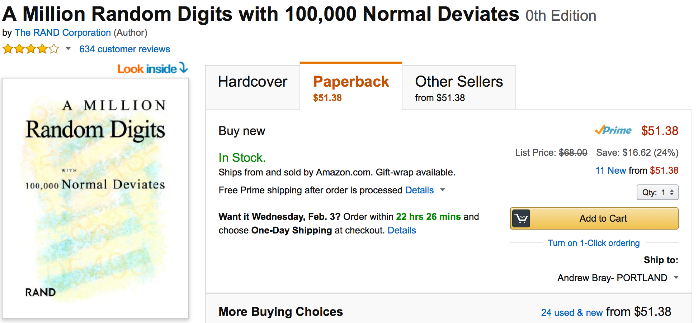

## Random numbers {.build}




## 


## Random digits in R {.build}

```{r}
runif(3)
```

Generates 3 numbers uniformly between 0 and 1.

```{r}
rnorm(3)
```

Generates 3 numbers from a standard normal distribution.

```{r}
rnorm(3, mean = 4, sd = .5)
```


## {.build}

```{r}
rnorm(3)
rnorm(3)
set.seed(485)
rnorm(3)
set.seed(485)
rnorm(3)
```


## Generative Models

Many statistical models are **generative**: they represent probability distributions
from which we're able to take random samples. That is, once you have the model
(true or estimated) you are able to generate as much data as you like.


# Simulation from true model

## Example: polynomial regression {.build}

True mean function:
$$
\begin{array}
\textrm{f}(x) &= \beta_0 + \beta_1 X + \beta_2 X^2 \\
&= 23 + 4 X - 3.2 X^2
\end{array}
$$

True data generating function:

$$
Y = f(x) + \epsilon; \quad \epsilon \sim N(0, 11)
$$

```{r}
x <- seq(5, 35, .1)
f <- function(x) {
  23 + 11 * x - .4 * x^2
}
y <- f(x) + rnorm(length(x), mean = 0, sd = 11)
```


##

$$
\textrm{f}(x) = \beta_0 + \beta_1 X + \beta_2 X^2
$$

```{r echo = FALSE}
df <- data.frame(x = x, f = f(x))
library(ggplot2)
p1 <- ggplot(df, aes(x = x, y = f)) + 
  ylim(c(-110, 130)) +
  ylab("y")
p1 + geom_line(col = I("goldenrod"), lwd = 1)
  
```


##

$$
Y = \beta_0 + \beta_1 X + \beta_2 X^2 + \epsilon; n = 20
$$

```{r echo = FALSE}
x <- runif(20, 5, 35)
df_pt <- data.frame(x = x, y = f(x) + rnorm(length(x), mean = 0, sd = 11))
p1 + geom_point(data = df_pt, aes(x = x, y = y)) +
  geom_line(col = I("goldenrod"), lwd = 1)
```


##

$$
Y = \beta_0 + \beta_1 X + \beta_2 X^2 + \epsilon; n = 20000
$$

```{r echo = FALSE, warning = FALSE}
x <- runif(20000, 5, 35)
df_pt <- data.frame(x = x, y = f(x) + rnorm(length(x), mean = 0, sd = 11))
p1 + geom_point(data = df_pt, aes(x = x, y = y), alpha = .1) +
  geom_line(col = I("goldenrod"), lwd = 1)
```


# Estimation

## Procedure {.build}

1. Assume true generative model
2. Generate data set of size $n$
3. Estimate $\hat{f}$
4. Repeat 2 and 3 many times to get a sense of the variation in $\hat{f}$


## Estimating $\hat{f}$ {.build}

Let's naively assume a *linear form*, work with data sets of size 20, and fit 
$\hat{f}$ by least squares.

$$
f(X) = \beta_0 + \beta_1 X
$$


## {.build}

```{r, echo = FALSE}
set.seed(34)
x <- runif(20, 5, 35)
df_pt <- data.frame(x = x, y = f(x) + rnorm(length(x), mean = 0, sd = 11))
fhat <- lm(y ~ x, data = df_pt)
df_fhat <- data.frame(x = x, f = fhat$fit)
(p2 <- p1 + geom_point(data = df_pt, aes(x = x, y = y), col = I("steelblue")) +
  geom_line(data = df_fhat, aes(x = x, y = f), col = I("steelblue")))
```

$$
\hat{f}(X) = 154 - 5 X
$$


##

```{r, echo = FALSE}
set.seed(28)
x <- runif(20, 5, 35)
df_pt <- data.frame(x = x, y = f(x) + rnorm(length(x), mean = 0, sd = 11))
fhat <- lm(y ~ x, data = df_pt)
df_fhat <- data.frame(x = x, f = fhat$fit)
p2 + geom_point(data = df_pt, aes(x = x, y = y), col = I("tomato")) +
  geom_line(data = df_fhat, aes(x = x, y = f), col = I("tomato"))
```

$$
\hat{f}(X) = 141 - 4.7 X
$$


##

```{r cache = TRUE, warning = FALSE, echo = FALSE}
df_fhat <- cbind(df_fhat, group = rep(0, nrow(df_fhat)))
for(i in 1:1000) {
  x <- runif(20, 5, 35)
  df_pt <- data.frame(x = x, y = f(x) + rnorm(length(x), mean = 0, sd = 11))
  fhat <- lm(y ~ x, data = df_pt)$fit
  df_fhat_new <- data.frame(x = x, f = fhat, group = rep(i, length(x)))
  df_fhat <- rbind(df_fhat, df_fhat_new)
}
p1 + geom_line(data = df_fhat, aes(x = x, y = f, group = group),
               col = I("steelblue"), alpha = .05)
```


##

```{r cache = TRUE, warning = FALSE, echo = FALSE}
p1 + geom_line(data = df_fhat, aes(x = x, y = f, group = group),
               col = I("steelblue"), alpha = .05) +
  geom_line(col = I("goldenrod"), lwd = 1)
```


