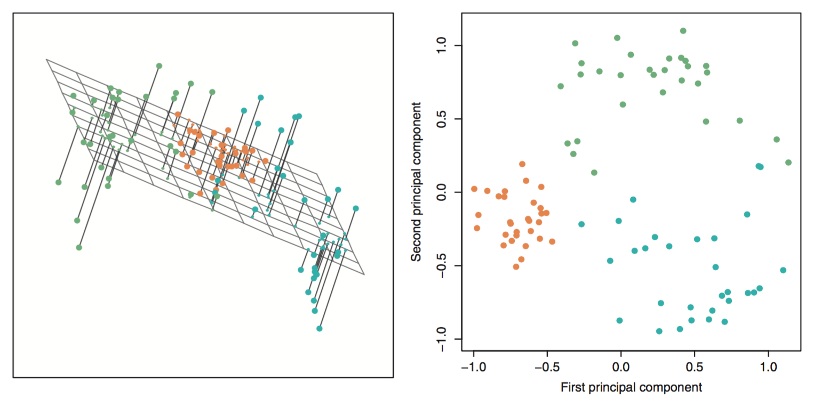

```{r echo = FALSE, warning=FALSE, message=FALSE}
library(knitr)
opts_chunk$set(warning = FALSE, message = FALSE)
```


## {.vcenter .flexbox}


## Ex: Fine Fragrance {.build}

```{r echo = FALSE}
experts <- read.table(file = "../data/perfumes.csv", header = TRUE, sep = ",",
                      dec = ".", quote= "\"")

library(dplyr)
experts <- experts %>%
  filter(Session == 1) %>%
  select(-Panelist, -Session, -Rank)
n <- names(experts)
names(experts) <- LETTERS[1:12]
experts <- experts %>%
  group_by(A) %>%
  summarize(Spicy = mean(B),
            Heady = mean(C),
            Fruity = mean(D),
            Green = mean(E),
            Vanilla = mean(F),
            Floral = mean(G),
            Woody = mean(H),
            Citrus = mean(I),
            Marine = mean(J),
            Greedy = mean(K),
            Oriental = mean(L)) %>%
  as.data.frame()
```

- 12 experts were asked to rate 12 perfumes on 11 scent adjectives.

```{r echo = FALSE}
names(experts)[-1]
names(experts)[1] <- "perfume"
```

- Each rating is on the scale 1 - 10.
- Ratings for each perfume were averaged across experts.


##

```{r}
head(experts)
```

## Learning structure{.build} 
- How do we visualize this data set?
$$ {p \choose 2} = 55 \textrm{ possible scatterplots}$$ 
- Representing *all* of the structure in the data requires $p = 11$ dimensions.
- Can we represent *most* of the structure using fewer dimensions?


##

```{r echo = FALSE, fig.height=5, fig.width = 5, fig.align='center'}
pca1 <- prcomp(experts[, -1], scale = TRUE)

library(ggplot2)
d <- as.data.frame(pca1$x)
d$perfume <- experts$perfume
levels(d$perfume)[levels(d$perfume)=="Cin\xe9ma"] <- "Cinema"
p1 <- ggplot(d, aes(x = PC1, y = PC2)) +
  geom_point() +
  geom_text(aes(label = perfume), position = position_nudge(y = -0.1), check_overlap = TRUE) +
  xlim(c(-5, 5)) +
  annotate("text", label = "J'adore ET", x = 3, y = .2)
p1
```


## Principle Component Analysis (PCA) {.build}

Produces a low-dimensional representation of a dataset. It finds a sequence of linear combinations of the variables that have maximal variance and are mutually uncorrelated.

Used to:

- Visualize structure in data
- Learn about latent meta-variables
- Produce imputs for subsequent supervised learning

#

## Dimension Reduction {.build .flexbox .vcenter}

Reducing from $p = 3$ to 2 principal components.




## Finding PCs {.build}

For each component, we want the $\phi$ vector that solves the optimization problem:

$$\textrm{max} \left(\frac{1}{n} \sum_{i = 1}^n z_{i1}^2 \right) \textrm{ subject to } \sum_{j = 1}^p \phi_{j1}^2 = 1$$

where each $z_{i1} = \sum_{j = 1}^p \phi_{j1}x_{ij}$.

Can be solved via an eigen decomposition (loadings = )

##

```{r echo = FALSE, fig.height=6, fig.width = 6, fig.align='center'}
biplot(pca1)
```

