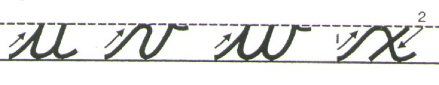

```{r echo = FALSE, warning=FALSE, message=FALSE}
library(knitr)
opts_chunk$set(warning = FALSE, message = FALSE)
```


## Ex. More Crime {.build}

This data set contains statistics, in arrests per 100,000 residents for assault, murder, and rape in each of the 50 US states in 1973. Also given is the percent of the population living in urban areas.

```{r}
head(USArrests)
```


## PCA {.build}

```{r}
pca1 <- prcomp(USArrests, scale = TRUE)
names(pca1)
```

- `rotation` holds the matrix of loadings; the $\phi$'s.
- `x` holds the scores for the principle components; the $z_{ij}$.

## Interpretation {.build}

```{r}
pca1$rotation
```

- PC1: crime
- PC2: urbanization

##

```{r echo = FALSE, fig.height=5, fig.width = 5, fig.align='center'}
library(ggplot2)
d <- as.data.frame(pca1$x)
d$state <- row.names(d)
p1 <- ggplot(d, aes(x = PC1, y = PC2)) +
  geom_point() +
  geom_text(aes(label = state), position = position_nudge(y = -0.1))
p1
```


## Biplot

```{r echo = FALSE}
biplot(pca1)
```


## Interpretation {.build}

```{r}
pca1$rotation
names(pca1)
pca1$sdev
```

## Constructing a scree plot {.build}

Used to visualize the proportion of variance explained (PVE) by each PC.

```{r eval = FALSE}
d <- data.frame(PC = 1:4,
                PVE = pca1$sdev^2 / sum(pca1$sdev^2))
ggplot(d, aes(x = PC, y = PVE)) +
  geom_line() + 
  geom_point()
```

## Scree plot

```{r echo = FALSE}
d <- data.frame(PC = 1:4,
                PVE = pca1$sdev^2 / sum(pca1$sdev^2))
ggplot(d, aes(x = PC, y = PVE)) +
  geom_line() + 
  geom_point()
```

## How many PCs? {.build}

- 1st PC: 62% PVE
- 1st + 2nd PC: 62 + 25 = 87% PVE

Usually most of the structure is in the first several principal components, but results may vary!

*Rule of thumb*: look for the elbow in the scree plot.


#

## Principle Component Analysis (PCA) {.build}

Produces a low-dimensional representation of a dataset. It finds a sequence of linear combinations of the variables that have maximal variance and are mutually uncorrelated.

Used to:

- Visualize structure in data
- Learn about latent meta-variables
- Produce imputs for subsequent supervised learning


## Handwritten Letters {.build}

```{r echo = FALSE, eval = FALSE}
d <- read.delim("../data/handwritten-raw.txt", header = FALSE)
library(dplyr)
d2 <- d %>%
  select(-V1, -V3, -V4, -V5, -V6, -V135)
ind <- c(1:8,
         1:8 + 16,
         1:8 + 32,
         1:8 + 48,
         1:8 + 64,
         1:8 + 80,
         1:8 + 96,
         1:8 + 112) + 1
d4 <- d2[, c(1, ind)]
names(d4)[1] <- "letter" 

write.csv(d4, file = "../data/handwritten.csv", row.names = FALSE)
```



How much information is encoded in a 8 x 8 image of a handwritten letters?

## Practice {.build}

Find the code to download the handwritten data set on the website under Week 10.

1. What do the columns and rows appear to represent in this dataset?
2. Select a letter of the alphabet and create a new dataset that includes only the images of that letter.
3. Visualize a few of those images using `plot_letter()` function.
4. Compute the *mean* image for that letter and visualize it.

##

```{r echo = FALSE, fig.width = 5, fig.height = 5}
d <- read.csv("../data/handwritten.csv")

library(dplyr)
g_data <- d %>%
  filter(letter == "g")

plot_letter <- function(x, hasletter = TRUE) {
  if(hasletter) {
    a <- as.numeric(x[, -1])
  }else{a <- as.numeric(x)}
  m <- matrix(a, nrow = 8, byrow = TRUE)
  m <- t(apply(m, 2, rev)) # rotate matrix
  image(m, axes = FALSE, col = rev(grey(seq(0, 1, length = 256))))
  box()
}

plot_letter(g_data[19, ])

g_mean <- colSums(g_data[, -1])/nrow(g_data)
plot_letter(g_mean, hasletter = FALSE)
```


## Dimension reduction

Can we capture most of the structure in a smaller number of dimensions?

$$m < p ?$$

1. Perform PCA on your data set using the `prcomp()` function (detailed in the 
slides from last time).
2. Construct a scree plot showing the PVE for the first 20 PCs.


##

```{r echo = FALSE}
pca1 <- prcomp(g_data[, -1])
d <- as.data.frame(pca1$x)
p1 <- ggplot(d, aes(x = PC1, y = PC2)) +
  geom_point()
p1
```


## 
```{r echo = FALSE}
d <- data.frame(PC = 1:20,
                PVE = pca1$sdev[1:20]^2 / sum(pca1$sdev[1:20]^2))
ggplot(d, aes(x = PC, y = PVE)) +
  geom_line() + 
  geom_point()
```


