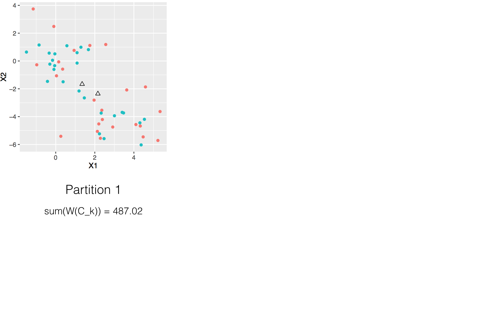
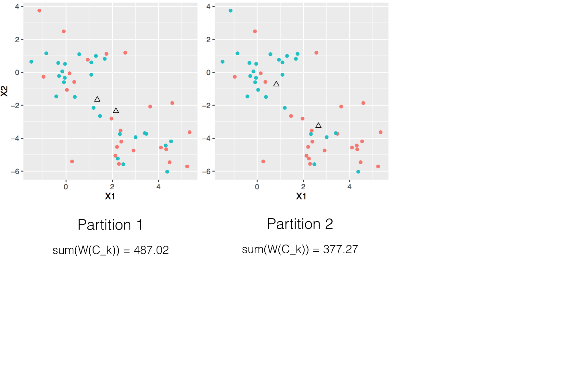
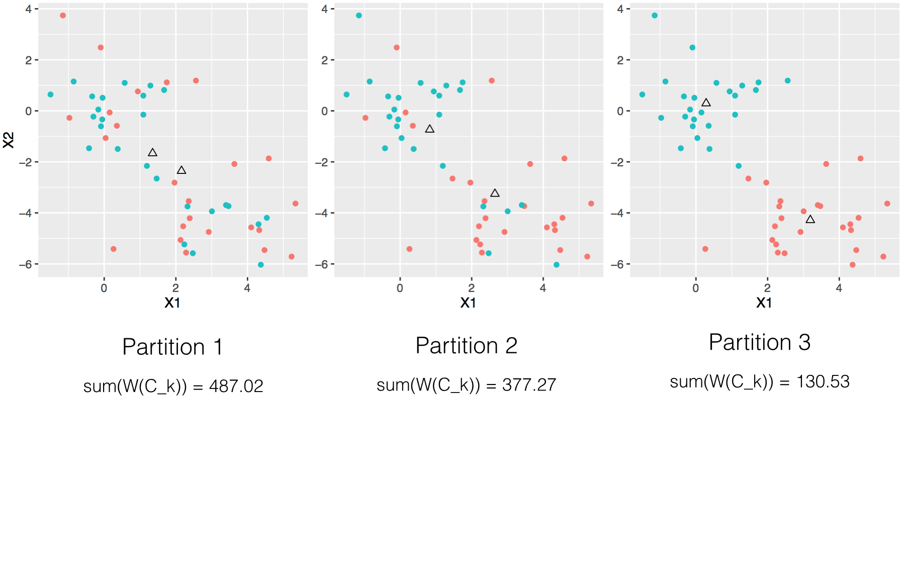
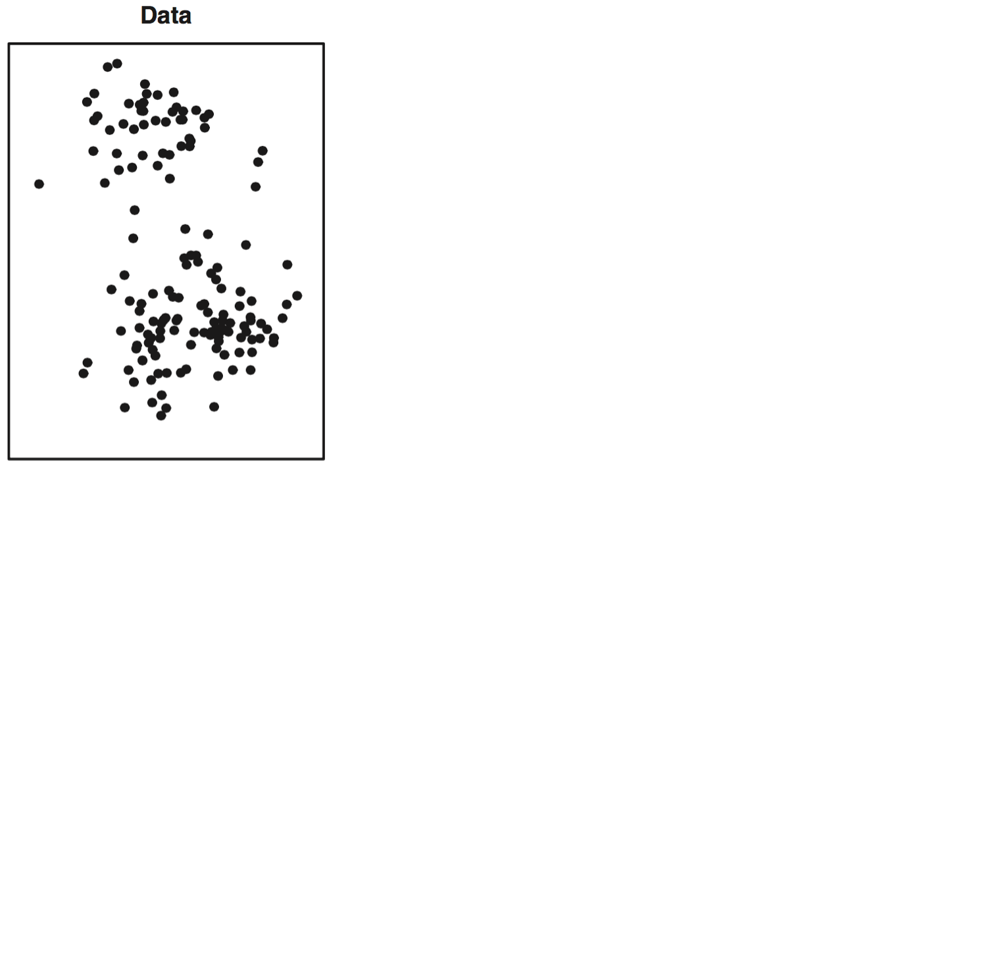
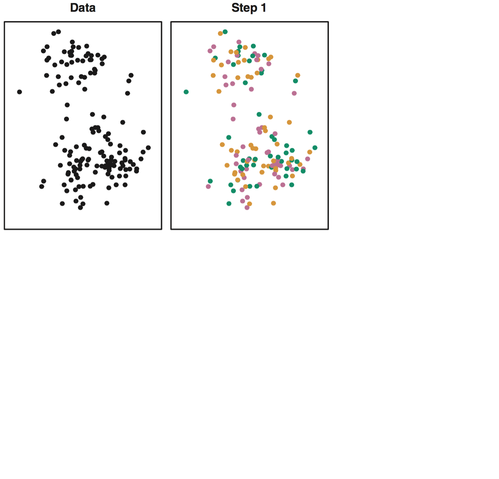
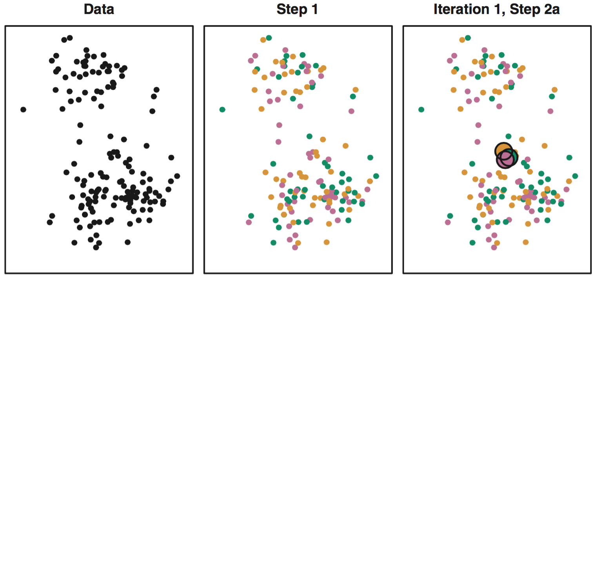
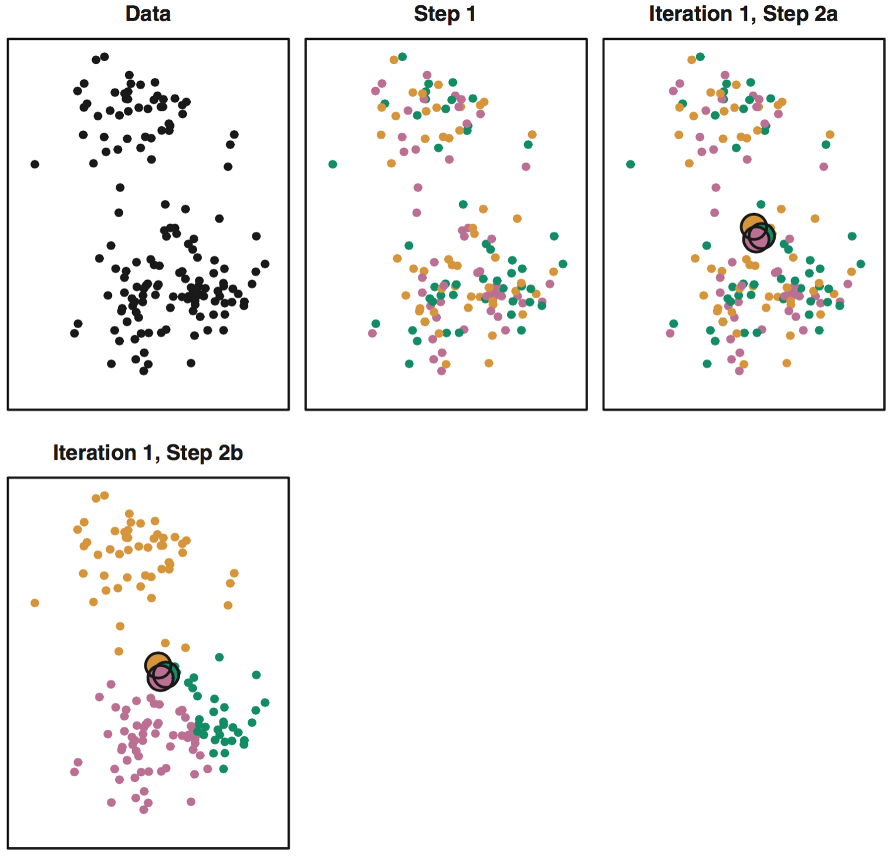
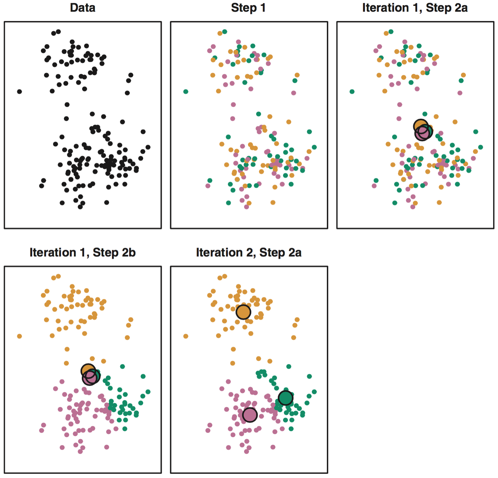
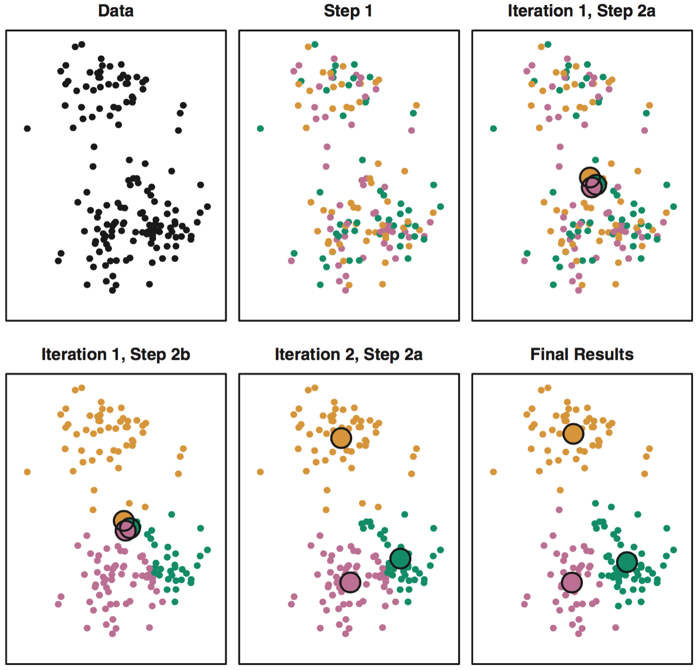

```{r echo = FALSE, warning=FALSE, message=FALSE}
library(knitr)
opts_chunk$set(warning = FALSE, message = FALSE)
```

##

```{r echo = FALSE, message = FALSE}
set.seed(304)
x <- matrix(rnorm(50 * 2), ncol = 2)
x[1:25, 1] <- x[1:25, 1] + 3
x[1:25, 2] <- x[1:25, 2] - 4
library(ggplot2)
library(dplyr)

d <- data.frame(x, group = as.factor(1))
p0 <- ggplot(d, aes(x = X1, y = X2, col = group)) +
  geom_point() + guides(colour=FALSE)

group <- as.factor(rep(1:2, each = 25))
d <- data.frame(x, group)
dc <- d %>%
  group_by(group) %>%
  summarize(meanX1 = mean(X1),
            meanX2 = mean(X2),
            SS1 = 24 * var(X1),
            SS2 = 24 * var(X2))
#sum(dc$SS1, dc$SS2)
p1 <- ggplot(d, aes(x = X1, y = X2, col = group)) +
  geom_point() + guides(colour=FALSE) +
  geom_point(data = dc, aes(x = meanX1, y = meanX2), shape = 2, col = "black", size = 2)

d <- data.frame(x, group = group[c(1:15, 26:35, 16:24, 35:50)])
dc <- d %>%
  group_by(group) %>%
  summarize(meanX1 = mean(X1),
            meanX2 = mean(X2),
            SS1 = 24 * var(X1),
            SS2 = 24 * var(X2))
#sum(dc$SS1, dc$SS2)
p2 <- ggplot(d, aes(x = X1, y = X2, col = group)) +
  geom_point() + guides(colour=FALSE) +
  geom_point(data = dc, aes(x = meanX1, y = meanX2), shape = 2, col = "black", size = 2)


d <- data.frame(x, group = group[c(6:25, 46:50, 1:5, 26:45)])
dc <- d %>%
  group_by(group) %>%
  summarize(meanX1 = mean(X1),
            meanX2 = mean(X2),
            SS1 = 24 * var(X1),
            SS2 = 24 * var(X2))
#sum(dc$SS1, dc$SS2)
p3 <- ggplot(d, aes(x = X1, y = X2, col = group)) +
  geom_point() + guides(colour=FALSE) +
  geom_point(data = dc, aes(x = meanX1, y = meanX2), shape = 2, col = "black", size = 2)
```

```{r echo = FALSE, eval = FALSE}
pdf(file = "plot1.pdf", height = 3.5, width = 3.5)
p1
dev.off()

pdf(file = "plot2.pdf", height = 3.5, width = 3.5)
p2
dev.off()

pdf(file = "plot3.pdf", height = 3.5, width = 3.5)
p3
dev.off()
```

```{r echo = FALSE, fig.align="center", fig.width=5.5}
p0
```


##



##



##



## Algorithm 10.1 {.build}

1. Randomly assign each obs. to 1 of K clusters.
2. Iterate until the clusters stop changing:
    - For each of the K clusters, compute the centroid (i.e. mean vector).
    - Assign each observation to the cluster whose centroid is closest (by Euclidean distance).


##



##



##



##



##



##



## Important considerations {.build}

1. The final partition is dependent on initial assignments.
    - *Solution*: run the algorithm several times with different starting conditions and select best.
2. Consider scaling the variables
    - Scale if you want "similar" to mean close w.r.t. all variables.


## Practice {.build}

Use K-means clustering to identify the best 2, 3, and 4 clusterings of US states based on the data in the `poverty`. Use Euclidean distance for your similarity measure.

Useful functions:

- `kmeans`
- `set.seed()`

1. What do the variables seem to mean?
2. Find best cluster assignments of size K.
3. Generate a scatterplot of the 51 obs and their first two PCs.
4. Color code each with their cluster assignment.


##

```{r, echo = FALSE, eval = FALSE}
poverty <- read.delim("https://raw.githubusercontent.com/andrewpbray/math-243/gh-pages/assets/data/poverty.txt", header = TRUE)
head(poverty)
set.seed(40)
km1 <- kmeans(poverty[ ,-1], 4, nstart = 20)
pca1 <- prcomp(poverty[, -1])
d <- data.frame(PC1 = pca1$x[, 1],
                PC2 = pca1$x[, 2],
                cluster = as.factor(km1$cluster),
                state = poverty$State)
ggplot(d, aes(x = PC1, y = PC2, col = cluster)) +
  geom_point() +
  geom_text(aes(label = state), hjust = 0, vjust = 0, size = 3)
```


