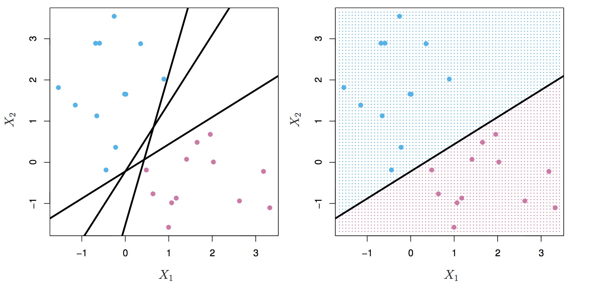
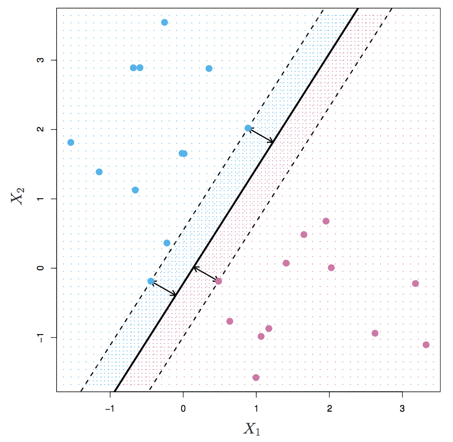
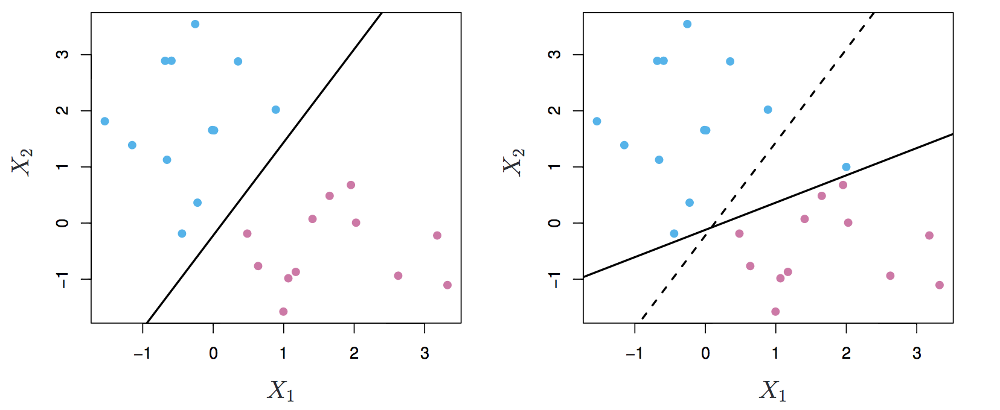
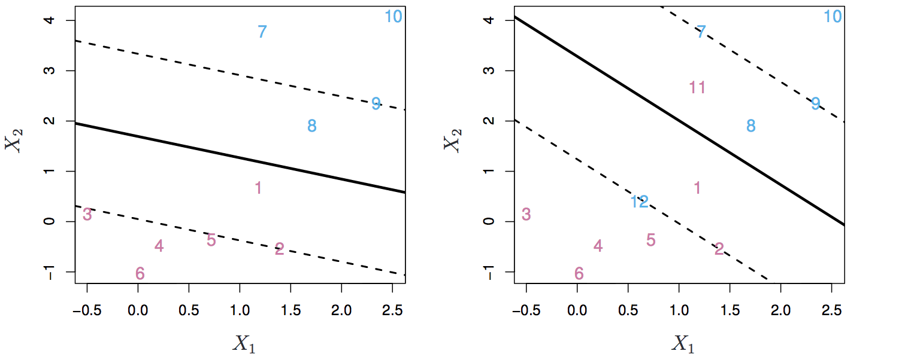
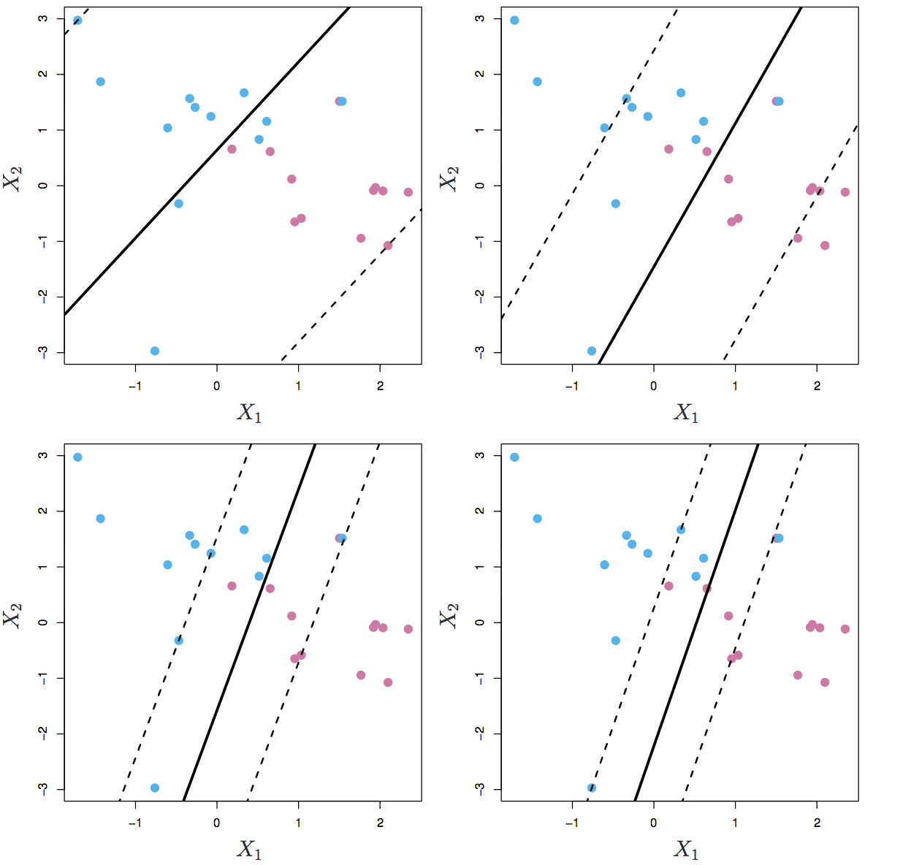
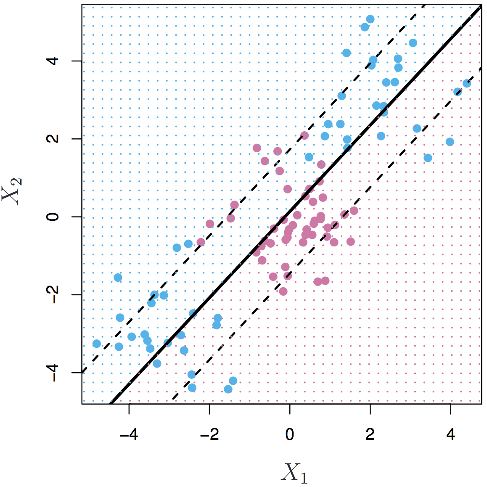
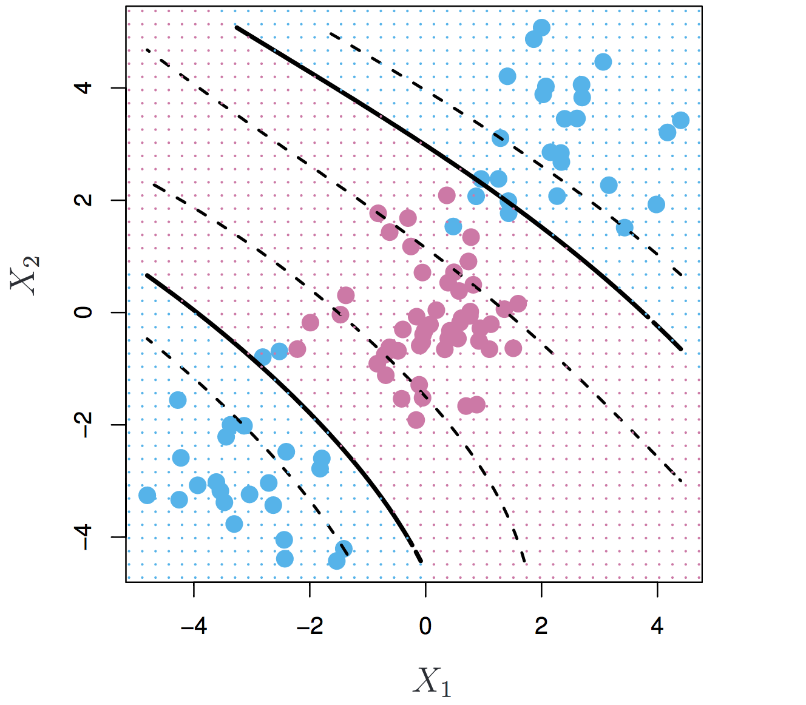
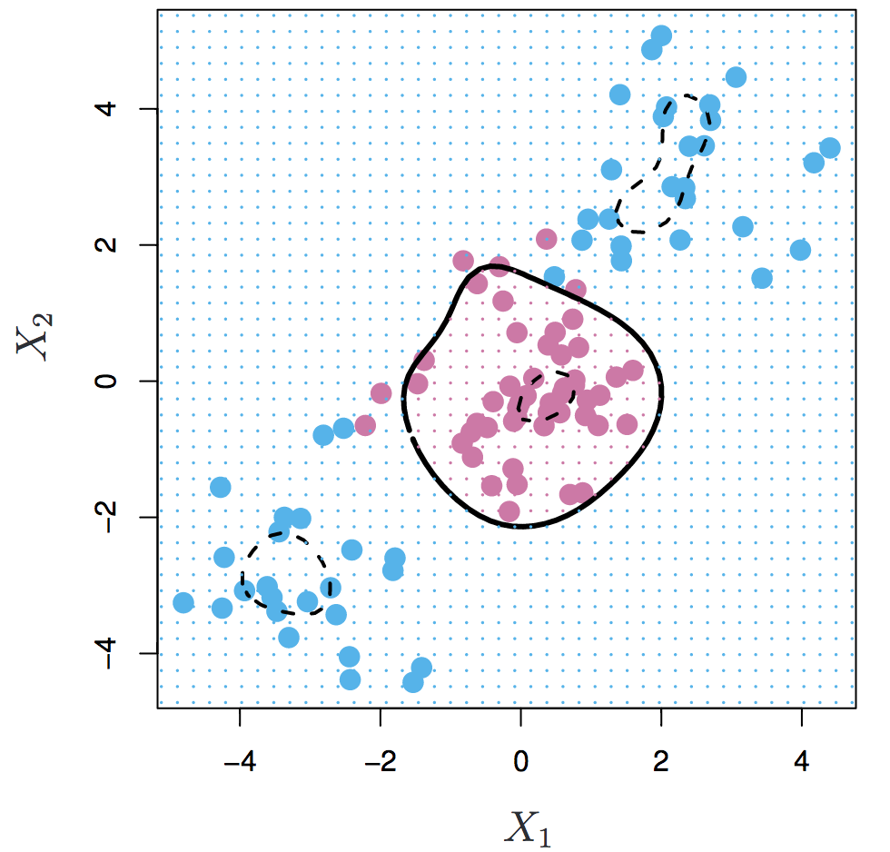

```{r echo = FALSE, warning=FALSE, message=FALSE}
library(knitr)
opts_chunk$set(warning = FALSE, message = FALSE)
```

## Separating Hyperplanes {.build .smaller}
<!-- These slides make extensive use of plots from An Introduction to Statistical Learning by James et al.-->



- If $f(X) = \beta_0 + \beta_1 X_1 + \beta_2 X_2$, then $f(X) > 0$ for points on one side of the hyperplane and $f(X) < 0$ for points on the other.
- If you code blue points $Y = +1$ and pink points $Y = -1$, then $y_i \cdot f(x_i) > 0$ for all $i$ and you have a *separating hyperplane*.


## Maximal Margin Classifier {.build .vcenter .flexbox .smaller}

Among all separating hyperplanes, find the one that makes the biggest gap or margin between the two classes.



Each observation that anchors the margin is called a *support vector*.


## Finding the Max. Margin {.build}

A constrained optimization problem (looks similar to ridge, lasso):

Find the $\beta_0, \beta_1, \ldots, \beta_p$ that maximize $M$ subject to:

- $y_i (\beta_0 + \beta_1 x_{i1} + \ldots + \beta_p x_{ip}) \ge M$ for all $i = 1, \ldots, n$.
- $\sum_{j = 1}^p \beta_j^2 = 1$

That is, all points are beyond the margin, as measured in Euclidean distance.


## Noisy data {.build}



Hard margins can lead to a classifier that is not robust to outliers.

Solution: use a *soft* margin (this is the first Big Idea).


## {.build .smaller}



Find the $\beta, \epsilon_i$ that maximize $M$ subject to:

- $y_i (\beta_0 + \beta_1 x_{i1} + \ldots + \beta_p x_{ip}) \ge M(1 - \epsilon_i)$ for all $i = 1, \ldots, n$.
- $\epsilon_i \ge 0$, $\sum_{i = 1}^n \epsilon_i \le C$
- $\sum_{j = 1}^p \beta_j^2 = 1$

Where $C$ is your fudge factor budget, selected via cross-validation.

#

## {.flexbox .vcenter}




## The Non-separable Case {.build .flexbox .vcenter}



Sometimes you can't get a decent hyperplane no matter the $C$.

What to do?


#

## Feature Expansion {.build}

- Enlarge the feature space by including transformations; e.g. $X_1$, $X_1^2$,
$X_1^3$, $X_3$, $X_1 X_3$.
- Fit a support vector classifier in the enlarged space.
- What was a hyperplane in high dimension results in a non-linear decision boundary in the original space.

#### Example

If $p = 2$, add quadratics and an interaction.

$$
\beta_0 + \beta_1 X_1 + \beta_2 X_2 + \beta_3 X_1^2 + \beta_4 X_2^2 + \beta_5 X_1 X_2 = 0
$$

Which is quadratic in the original $X_1, X_2$ space.


## Cubic Polynomial Expansion {.build .flexbox .vcenter}



Polynomials can get squirrely in high dimensions, so it tends to work better to expand the feature space using *kernel functions*.


## Kernel Functions {.build}

The linear support vector classifier can be rewritten as

$$
f(x) = \beta_0 + \sum_{i = 1}^n \alpha_i \langle x, x_i \rangle
$$

- Where $\langle x, x_i \rangle$ is the inner product of two observations, a measure of their similarity.
- Each observation has a "weight" attached to it, $\alpha_i$.
- All $\alpha_i$ will be zero except for the *support vectors*.

**Kernel function**: A similarity measure that implies a high dimensional feature space.

$$
f(x) = \beta_0 + \sum_{i = 1}^n \alpha_i K(x, x_i)
$$


## Choosing a Kernel {.build .flexbox .vcenter}

One common choice is the *radial kernel*:

$$
K(x, x_i) = \exp(-\gamma \sum_{j = 1}^p (x_{ij} - x_{i'j})^2)
$$

